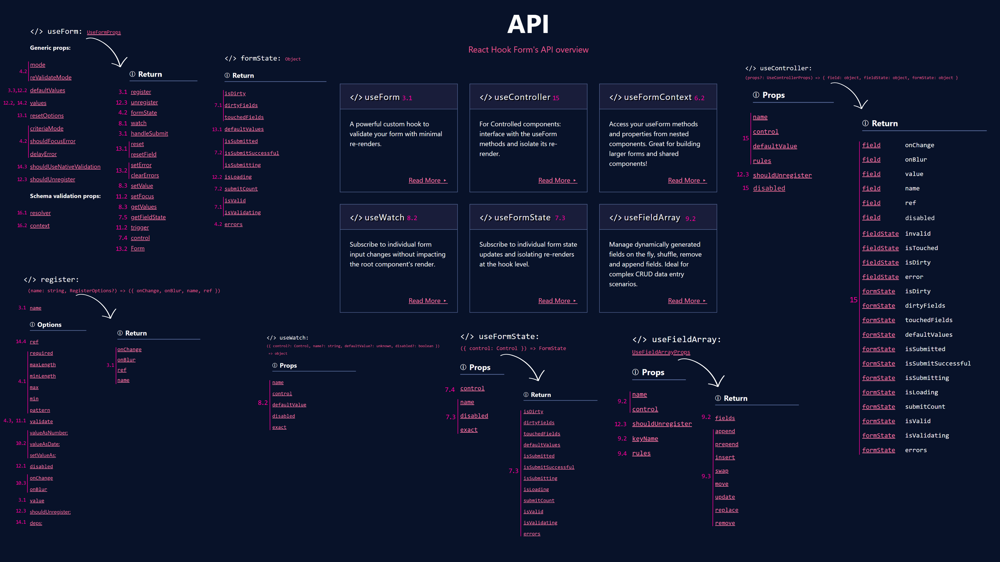

# Food Delivery Form

App is a complex food delivery form allowing restaurant employees to take orders from customers. Project relates to [React Hook Form: The Complete Guide with React (2024)](https://www.udemy.com/course/react-hook-form-the-complete-guide-with-react-js) Udemy course by [Shamseer](https://www.udemy.com/user/shamseer-k-6) and is [React Hook Form](https://react-hook-form.com) practice.

## React + TypeScript + Vite

This template provides a minimal setup to get React working in Vite with HMR and some ESLint rules.

Currently, two official plugins are available:

- [@vitejs/plugin-react](https://github.com/vitejs/vite-plugin-react/blob/main/packages/plugin-react/README.md) uses [Babel](https://babeljs.io/) for Fast Refresh
- [@vitejs/plugin-react-swc](https://github.com/vitejs/vite-plugin-react-swc) uses [SWC](https://swc.rs/) for Fast Refresh

### Expanding the ESLint configuration

If you are developing a production application, we recommend updating the configuration to enable type aware lint rules:

- Configure the top-level `parserOptions` property like this:

```js
export default tseslint.config({
  languageOptions: {
    // other options...
    parserOptions: {
      project: ['./tsconfig.node.json', './tsconfig.app.json'],
      tsconfigRootDir: import.meta.dirname,
    },
  },
});
```

- Replace `tseslint.configs.recommended` to `tseslint.configs.recommendedTypeChecked` or `tseslint.configs.strictTypeChecked`
- Optionally add `...tseslint.configs.stylisticTypeChecked`
- Install [eslint-plugin-react](https://github.com/jsx-eslint/eslint-plugin-react) and update the config:

```js
// eslint.config.js
import react from 'eslint-plugin-react';

export default tseslint.config({
  // Set the react version
  settings: { react: { version: '18.3' } },
  plugins: {
    // Add the react plugin
    react,
  },
  rules: {
    // other rules...
    // Enable its recommended rules
    ...react.configs.recommended.rules,
    ...react.configs['jsx-runtime'].rules,
  },
});
```

### Running the Project

Project uses NPM as package manager. Run `npm install` to install project dependencies and `npm run dev` to start development.

### Deploy

App is deployed to GitHub pages: https://ntonbala.github.io/food-delivery-form. Deployment is done automatically from `main` branch.

## Cheat Sheet

Cheat sheet contains all of the important hooks, methods and properties with serial numbers of course lectures next to them:

